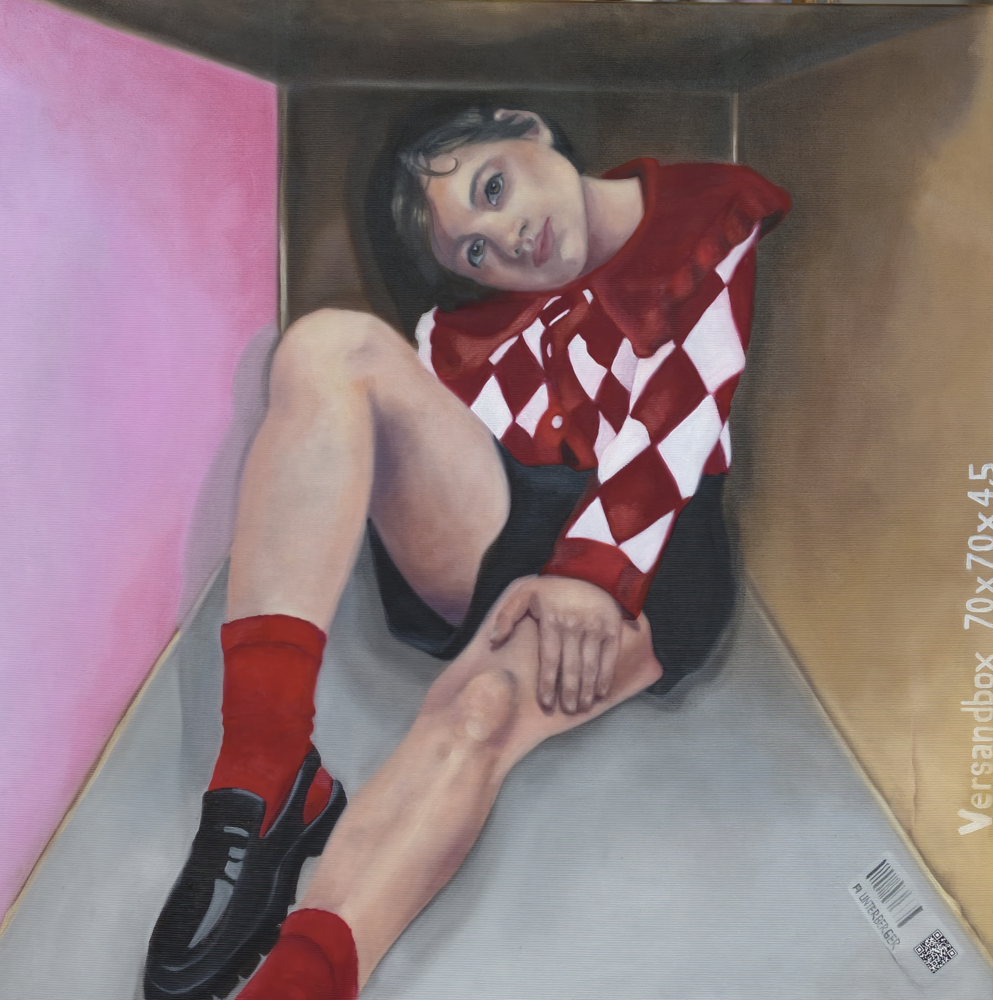

# Verdichtetes Leben

**Titel:** Verdichtetes Leben
**Technik:** Öl auf Leinwand  
**Größe:** 70 × 70 × 4,5 cm  
**Jahr:** 2026  
**Preis:** € 2.300

## Bildbeschreibung

Die Großstadt verspricht Freiheit, Nähe und grenzenlose Möglichkeiten - und wird zugleich zum engen Lebensraum. Die Figur sitzt eingepasst zwischen klaren Flächen, begrenzt von Architektur und Raum. Ihr direkter Blick widersetzt sich jedoch der Enge: aufmerksam,
selbstbewusst und verletzlich zugleich.

Kräftiges Rot, leuchtendes Rosa und das rhythmische Rautenmuster setzen einen lebendigen Kontrapunkt zur geometrischen Umgebung. Verdichtetes Leben erzählt vom urbanen Dasein zwischen Sichtbarkeit und Isolation, Anpassung und Individualität. Der Großstadtdschungel
erscheint hier nicht als wildes Grün, sondern als Geflecht aus Wänden, Blicken und Erwartungen - ein Ort, an dem der Mensch seinen eigenen Raum behaupten muss.
